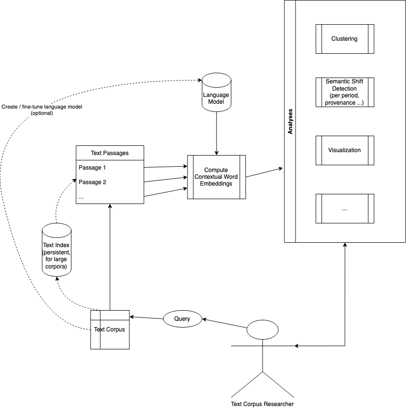

# Embeddings Analysis Toolset

## Workflow

## User Requirements

- Load different language models
- Load text data from various sources
  - Initial sources:
    - (NL) Delhper, ANP, StatenGeneraal
    - (EN) [COHA](https://www.english-corpora.org/coha/)
  - (Optional) implement text indexing with ElasticSearch for quick lookup of words
- Extract contextualized embeddings for specific words, tokens, or phrases
- (Interactive) embeddings visualization
- Measure semantic shifts across configurable metadata dimensions, including
  - time period
  - region
  - source (e.g. different newspapers)
- Extensive configuration, for instance:
  - which layer(s) to use
  - how to measure distances

## Software Design

- Load language model
  - use the HuggingFace `transformers` library to download models
    - allow for authentication to access private models
- Load text data
  - object oriented design with abstract classes to be implemented for custom formats
  - provide methods for (memory-efficient) loading, text search, lazy evaluation
  - implement corpus readers for plain text, CSV
  - implement corpus slicing on metadata dimensions (e.g. time period, region, source)
- Corpus statistics
  - based on corpus readers
  - statistical analyses:
    - document properties (e.g. lengths)
    - document distribution per metadata dimension
- Embeddings visualization
  - find texts (e.g. sentences) containing a specific word
    - to be implemented by corpus reader
    - plain string search or index-based search (TBD, depends on corpus size)
    - Compute contextualized word embeddings with `transformers` library
- Semantic shift metrics
  - Find clusters across corpus: k-means with user-defined `k`
    - Use [scikit-learn implementation](https://scikit-learn.org/stable/modules/clustering.html#k-means)
  - Find clusters (~meanings) across corpus (e.g. [Mean Shift](https://scikit-learn.org/stable/modules/clustering.html#mean-shift), [Hierarchical Clustering](https://scikit-learn.org/stable/modules/clustering.html#hierarchical-clustering))
  - Apply clustering per corpus slice
  - Measure semantic shift

Notebooks with example implementations:

- [Semantic Shift detection on ANP, Delpher, StatenGeneraal](https://github.com/Semantics-of-Sustainability/ContextualLM/blob/8d957fbf5ec3e46316873b7639f9378a24f60f3e/notebooks/SemanticShiftNL.ipynb)
- [Semantic shift detection on COHA corpus](https://github.com/Semantics-of-Sustainability/ContextualLM/blob/8d957fbf5ec3e46316873b7639f9378a24f60f3e/notebooks/SemanticShiftCOHA.ipynb)
